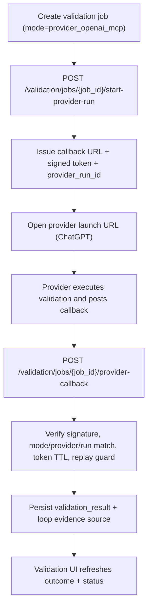
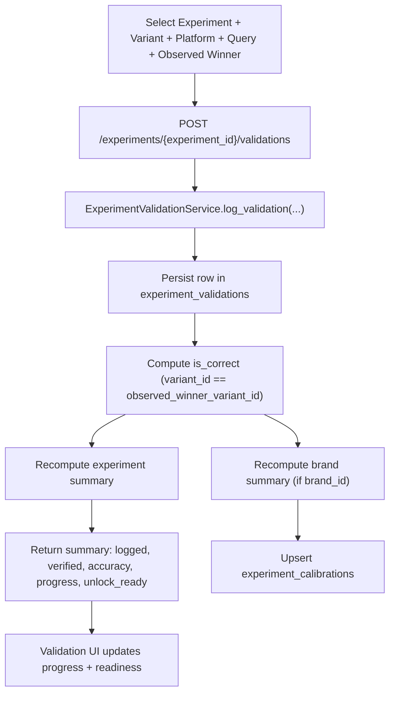
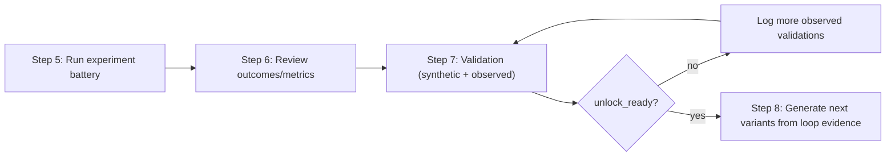
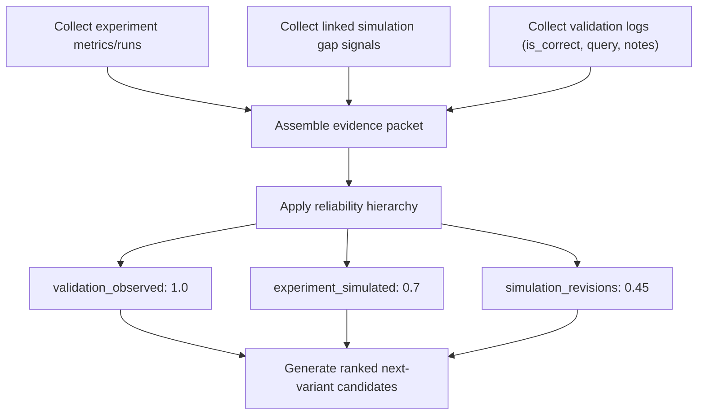
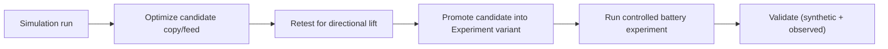

# App Workflows (Current + Planned)

This document maps implemented workflows and highlights planned gaps.

---

## 1) End-to-End Workflow Graph

```
Chat
  -> Alignment
    -> Evidence
      -> Simulation (run -> optimize -> retest)
  -> Experiments
      -> Query Battery Builder
      -> Variants
      -> Run + Metrics

Validation (centralized)
  -> Synthetic validation signal
  -> Observed reality signal
  -> Agreement + accuracy tracking

Learning Loop
  -> Belief revisions
  -> Policy decisions
  -> Memory distillation/retrieval
  -> Calibration refresh

Admin Onboarding
  -> Client
  -> Brand
  -> Product
  -> Canonical Intent Spec
  -> Review
```

---

## 2) Manual Workflow (Chat-first)

1. User starts in Chat.
2. Intent and goals are inferred/clarified.
3. Alignment evaluates product fit.
4. Evidence explains wins and gaps.
5. Simulation runs the scenario.
6. Optimization rewrites copy candidate.
7. Retest compares lift and stores lesson context.

Outputs currently available:
- intent/goals and rationale
- alignment scoring output
- evidence signal analysis
- simulation result + protocol readiness
- optimized candidate copy and retest lift summary

---

## 3) Experiment Workflow (Lab)

1. Create/select query battery.
2. Generate queries (`top_down`, `bottom_up`, `hybrid`).
3. Review accepted/rejected generation output.
4. Create experiment and variants.
5. Choose variant creation path:
   - manual authoring,
   - simulation revision prefill,
   - generate from loop evidence (experiment + simulation + validation),
   - generate cold-start copy (`bottom_up`, `top_down`, `both`) when history is sparse.
6. Optionally create selected generated candidate in one click.
7. Run experiment battery.
8. Review metrics and winners.
9. Send winner candidates to Validation flow.

Current guardrails:
- query quality gating before persistence
- bottom-up category confidence gate
- lab-only messaging separated from observed validation
- loop evidence reliability hierarchy: `validation > experiment > simulation`
- cold-start mode allows brand/metadata mentions if grounded in product/audience context

---

## 4) Query Battery Workflow (Current)

### Inputs
- battery metadata
- optional seed queries/features/use-cases
- canonical intent spec + product metadata
- optional LLM assist

### Execution
1. Build context capsule.
2. Generate deterministic baseline by mode.
3. Add optional LLM candidates.
4. Deduplicate and validate.
5. Retry once with stricter constraints if acceptance is low.

### Outputs
- accepted queries saved
- rejected queries + reasons surfaced
- eval counters logged (`query_generation_eval`)

### Important bottom-up behavior
- If category confidence is low, generation is blocked with a clarification prompt.
- User must set canonical category in Admin (Canonical Intent Spec) for that product.

---

## 5) Validation Workflow (Centralized)

Validation is intentionally decoupled from Experiment page and lives in Validation page:

### A) Synthetic validation signal
- LLM judge mode (BYOK provider/model)
- fast screening and copy-vs-copy consistency checks
- execution modes:
  - `in_app_byok` (in-app immediate run),
  - `provider_openai_mcp` (launch to ChatGPT + signed callback),
  - `manual_fallback` (structured paste-back),
  - `provider_gemini_function` (contract present, not yet executable).

### B) Observed reality signal
- manual observed logging of what actually surfaced
- used for true agreement and calibration

### Current data flow
1. Choose entity (experiment/simulation/battery).
2. Choose provider + mode.
3. Run job with `in_app_byok`, start `provider run`, or use `manual fallback`.
4. Persist validation job/result.
5. Update validation summaries and accuracy.

### Provider-run callback flow (OpenAI MCP)



---

## 5.1) Validation Flow Schema (Developer View)



### Observed reality: input-to-metric mapping

| Input field | Stored | Used in summary math | Used in loop evidence |
|---|---|---|---|
| `experiment_id` | yes | yes (scope) | yes |
| `variant_id` | yes | yes (`is_correct` comparison) | yes |
| `observed_winner_variant_id` | yes | yes (`is_correct`) | yes |
| `query_text` | yes | no | yes (`recent` evidence context) |
| `observed_products` | yes | no | not currently |
| `platform` | yes | no | not currently |
| `observed_position` | yes | no | not currently |
| `notes` | yes | no | yes (`recent` evidence context) |
| `created_at` | yes (`now` default) | no | indirectly (ordering/time context) |

### Readiness logic (current)

- `verified_runs`: rows where `is_correct IS NOT NULL`
- `accuracy`: `correct_runs / verified_runs`
- `unlock_ready`: `verified_runs >= 10` and `accuracy >= 0.75`
- `progress`: `min(verified_runs / 10, 1.0)`

---

## 5.2) Validation + Experiment Handoff Schema



---

## 6) Learning Loop Workflow (Current)

Loop control endpoints:
- `POST /beliefs/update`
- `POST /loop/step`
- `GET /loop/state`
- `GET /loop/metrics`
- `GET /memory/artifacts`
- `POST /memory/distill`
- `GET /calibration/profile`

Maintenance endpoints:
- `POST /admin/ops/loop-maintenance`
- `GET /admin/ops/loop-maintenance/history`

Current loop behavior:
1. Validation and run evidence contribute to belief revisions.
2. Policy service logs auditable decision events.
3. Memory service distills high-confidence/high-support artifacts.
4. Retrieval injects only quality-gated artifacts into generation.
5. Calibration profiles update from synthetic-vs-observed drift.

---

## 6.1) Evidence Weighting Schema (Loop Variant Generation)



---

## 6.2) Simulation-to-Experiment Handoff Schema



---

## 7) Admin Onboarding Workflow (Current)

Admin onboarding sections:
1. Client profile
2. Brand setup
3. Product catalog
4. Canonical intent spec
5. Review

Canonical spec supports:
- controlled ontology fields
- preview/apply autofill from UCP/ACP/feed
- raw + normalized + mapping traceability metadata

Operational controls:
- model gateway (BYOK chat/validation models)
- agent skills
- loop maintenance trigger and run history

---

## 8) Planned (Not Built Yet)

- richer normalization/ontology confidence pipeline
- stronger category classifier
- native GA4 connector (current analytics ingestion is generic)
- Gemini function-call provider run execution (mode is scaffolded, backend runtime not yet enabled)
- deeper automatic promotion logic for simulation lessons
- full backend serverless hardening for Vercel Python runtime
