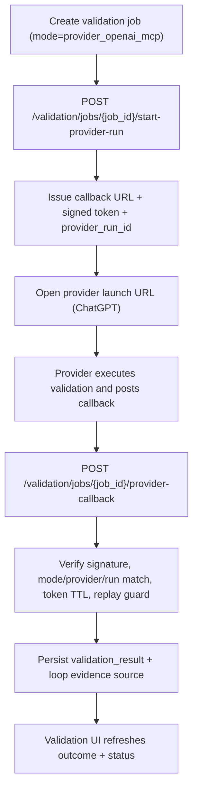
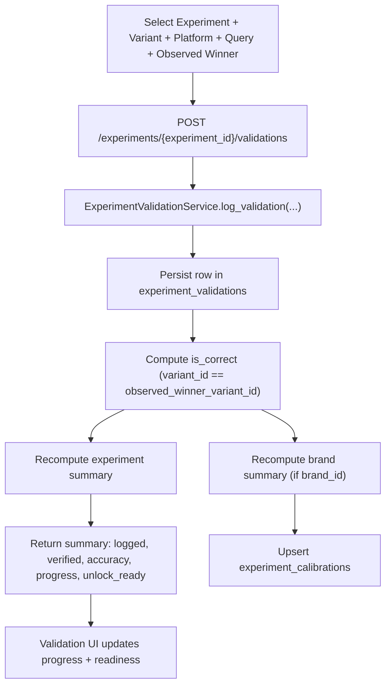
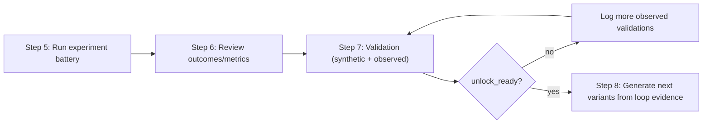
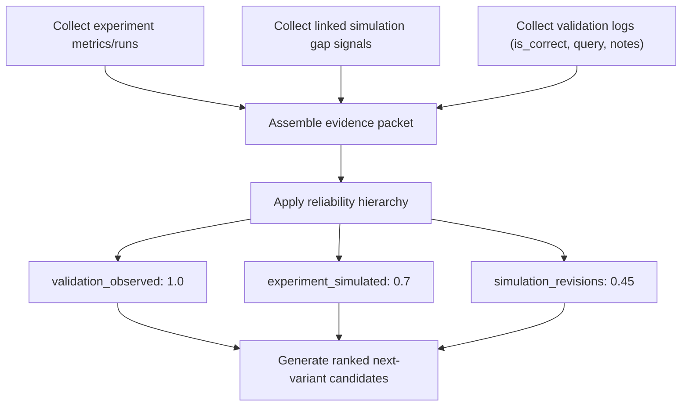
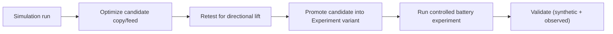

# Historical App Workflows (Lab-First Product)

Status: historical/reference
Current UX guide: `../operator-experience.md`
Current execution plan: `../platform-modernisation-plan-v2.md`

This document maps older lab-first workflows. Keep it as reference context, but do not treat it as the active product navigation model.

---

This document maps implemented workflows and highlights planned gaps.

---

## 1) End-to-End Workflow Graph

```
Chat
  -> Alignment
    -> Evidence
      -> Simulation (run -> optimize -> retest)
  -> Experiments
      -> Query Battery Builder
      -> Variants
      -> Run + Metrics

Validation (centralized)
  -> Synthetic validation signal
  -> Observed reality signal
  -> Agreement + accuracy tracking

Learning Loop
  -> Belief revisions
  -> Policy decisions
  -> Memory distillation/retrieval
  -> Calibration refresh

Admin Onboarding
  -> Client
  -> Brand
  -> Product
  -> Canonical Intent Spec
  -> Review
```

---

## 2) Manual Workflow (Chat-first)

1. User starts in Chat.
2. Intent and goals are inferred/clarified.
3. Alignment evaluates product fit.
4. Evidence explains wins and gaps.
5. Simulation runs the scenario.
6. Optimization rewrites copy candidate.
7. Retest compares lift and stores lesson context.

Outputs currently available:
- intent/goals and rationale
- alignment scoring output
- evidence signal analysis
- simulation result + protocol readiness
- optimized candidate copy and retest lift summary

---

## 3) Experiment Workflow (Lab, Current Protocol)

1. Create/select query battery.
2. Generate and save enabled queries.
3. Auto-initialize experiment context from product + battery when Step 4 starts.
4. Retrieval-backed baseline run creates frozen protocol snapshots (`snapshot_version`).
5. Baseline gate: candidate variants are blocked until control baseline is scored for current snapshot.
6. Hypotheses are persisted from baseline deltas and linked to variants/runs.
7. Create variants:
   - manual authoring,
   - simulation revision prefill,
   - loop evidence generation,
   - cold-start generation (`bottom_up`, `top_down`, `both`).
8. Run variants on the same frozen snapshot version.
9. Validate in Validation module (synthetic + observed).
10. Update posterior and decision action (`promote_variant` / `iterate_variant` / `reject_hypothesis`).

Current guardrails:
- query quality gating before persistence
- frozen retrieval snapshot protocol for fair variant comparison
- baseline-first enforcement in retrieval-backed mode
- explicit hypothesis linkage (`hypothesis_id`) for variants/runs
- loop evidence reliability hierarchy: `validation > experiment > simulation`
- posterior-driven decision action in run metrics

### 3.1) Protocol Transparency Endpoints

- `GET /experiments/{experiment_id}/execution-state`
- `GET /experiments/{experiment_id}/retrieval-snapshots`
- `GET /experiments/{experiment_id}/hypotheses`

---

## 4) Query Battery Workflow (Current)

### Inputs
- battery metadata
- optional seed queries/features/use-cases
- canonical intent spec + product metadata
- optional LLM assist

### Execution
1. Build context capsule.
2. Derive behavioral audience segments from recent session/analytics events (top-down/hybrid).
3. Generate deterministic baseline by mode.
4. Add optional LLM candidates.
5. Deduplicate and validate.
6. Retry once with stricter constraints if acceptance is low.

### Outputs
- accepted queries saved
- rejected queries + reasons surfaced
- eval counters logged (`query_generation_eval`)

### Important bottom-up behavior
- If category confidence is low, generation is blocked with a clarification prompt.
- User must set canonical category in Admin (Canonical Intent Spec) for that product.

---

## 5) Validation Workflow (Centralized)

Validation is intentionally decoupled from Experiment page and lives in Validation page:

### A) Synthetic validation signal
- LLM judge mode (BYOK provider/model)
- fast screening and copy-vs-copy consistency checks
- execution modes:
  - `in_app_byok` (in-app immediate run),
  - `provider_openai_mcp` (launch to ChatGPT + signed callback),
  - `manual_fallback` (structured paste-back),
  - `provider_gemini_function` (contract present, not yet executable).

### B) Observed reality signal
- manual observed logging of what actually surfaced
- used for true agreement and calibration

### Current data flow
1. Choose entity (experiment/simulation/battery).
2. Choose provider + mode.
3. Run job with `in_app_byok`, start `provider run`, or use `manual fallback`.
4. Persist validation job/result.
5. Update validation summaries and accuracy.

### Provider-run callback flow (OpenAI MCP)



---

## 5.1) Validation Flow Schema (Developer View)



### Observed reality: input-to-metric mapping

| Input field | Stored | Used in summary math | Used in loop evidence |
|---|---|---|---|
| `experiment_id` | yes | yes (scope) | yes |
| `variant_id` | yes | yes (`is_correct` comparison) | yes |
| `observed_winner_variant_id` | yes | yes (`is_correct`) | yes |
| `query_text` | yes | no | yes (`recent` evidence context) |
| `observed_products` | yes | no | not currently |
| `platform` | yes | no | not currently |
| `observed_position` | yes | no | not currently |
| `notes` | yes | no | yes (`recent` evidence context) |
| `created_at` | yes (`now` default) | no | indirectly (ordering/time context) |

### Readiness logic (current)

- `verified_runs`: rows where `is_correct IS NOT NULL`
- `accuracy`: `correct_runs / verified_runs`
- `unlock_ready`: `verified_runs >= 10` and `accuracy >= 0.75`
- `progress`: `min(verified_runs / 10, 1.0)`

---

## 5.2) Validation + Experiment Handoff Schema



---

## 6) Learning Loop Workflow (Current)

Loop control endpoints:
- `POST /beliefs/update`
- `POST /loop/step`
- `GET /loop/state`
- `GET /loop/metrics`
- `GET /memory/artifacts`
- `POST /memory/distill`
- `GET /calibration/profile`

---

## 7) Agent Operator Mode (Current + Next)

Agent operator mode is partially implemented and can already run approved steps under runtime controls.

Key principles:
1. Agent autonomy is **plan autonomy**, not raw execution autonomy.
2. The system remains the enforcement layer (baseline-first, frozen snapshots, spend caps, approval gates).
3. Capabilities are explicit and versioned (prompts, scoring parameters, validation weighting, provider configs).

Current implementation:
- `AgentRuntime` service is wired to `/agent-runs` controls (`start`, `pause`, `cancel`, `step`).
- `AgentRuntimeWorkerService` supports bounded autonomous execution via `POST /agent-runs/tick`.
- `AgentRuntimeSchedulerService` supports interval-based continuous orchestration across clients.
- Run-level event feed API is available via `GET /agent-runs/{run_id}/events`.
- `agent_runs` + `agent_actions` + immutable `agent_events` persistence is active.
- v0 defaults to `plan_only`; execution requires `auto_execute_safe`.
- runtime uses per-run short lease lock + heartbeat refresh.
- action execution is atomic (`approved -> executing -> executed|failed`).
- centralized capability specs + defaults are enforced through a registry contract.
- centralized policy checks enforce allow-list + required inputs + budgets (`max_actions`, `max_variant_runs`, `max_cost_usd`).
- `Agent runs` UI includes:
  - action explainability (why, side effects, linked artifacts),
  - next recommended action panel for operator focus,
  - budget telemetry + warning states,
  - inline guardrail explainability on blocked approvals,
  - detailed artifact diff drawer + copy diff mode,
  - execution timeline with:
    - deep-links and URL-synced state (`run_id`, filters, `event_id`),
    - presets (`All activity`, `Policy failures (24h)`, `Variant execution (7d)`, `Validation focus (7d)`),
    - server-side filters (`event_type`, `status`, `capability_name`, `since/until`),
    - pagination (`before/after`) and load-older UX,
    - live polling for newer events (paused when tab is hidden),
    - event recovery (`event_id + around`) when deep-linked event is outside current page window.
  - timeline reads persisted event history (`agent_events`) for stable audit/replay semantics.
- `Experiments` page includes an Agent operator entry panel with latest run status.

Still in progress:
- richer budget burn telemetry (historical trend/burn-rate visualization) and expanded artifact diff ergonomics

See `docs/agentic-layer.md`.

Test coverage now includes:
- service-layer event paging/filtering and event-centering tests (`tests/modules/test_agent_run_events_service.py`)
- API-layer events endpoint filter/cursor/centering tests (`tests/test_agent_runs_api.py`)

Maintenance endpoints:
- `POST /admin/ops/loop-maintenance`
- `GET /admin/ops/loop-maintenance/history`

Current loop behavior:
1. Validation and run evidence contribute to belief revisions.
2. Policy service logs auditable decision events.
3. Memory service distills high-confidence/high-support artifacts.
4. Retrieval injects only quality-gated artifacts into generation.
5. Calibration profiles update from synthetic-vs-observed drift.

---

## 6.1) Evidence Weighting Schema (Loop Variant Generation)



---

## 6.2) Simulation-to-Experiment Handoff Schema



---

## 7) Admin Onboarding Workflow (Current)

Admin onboarding sections:
1. Client profile
2. Brand setup
3. Product catalog
4. Canonical intent spec
5. Review

Canonical spec supports:
- controlled ontology fields
- preview/apply autofill from UCP/ACP/feed
- raw + normalized + mapping traceability metadata

Operational controls:
- model gateway (BYOK chat/validation models)
- agent skills
- loop maintenance trigger and run history

---

## 8) Planned (Not Built Yet)

- richer normalization/ontology confidence pipeline
- stronger category classifier
- native GA4 connector (current analytics ingestion is generic)
- Gemini function-call provider run execution (mode is scaffolded, backend runtime not yet enabled)
- deeper automatic promotion logic for simulation lessons
- full backend serverless hardening for Vercel Python runtime
