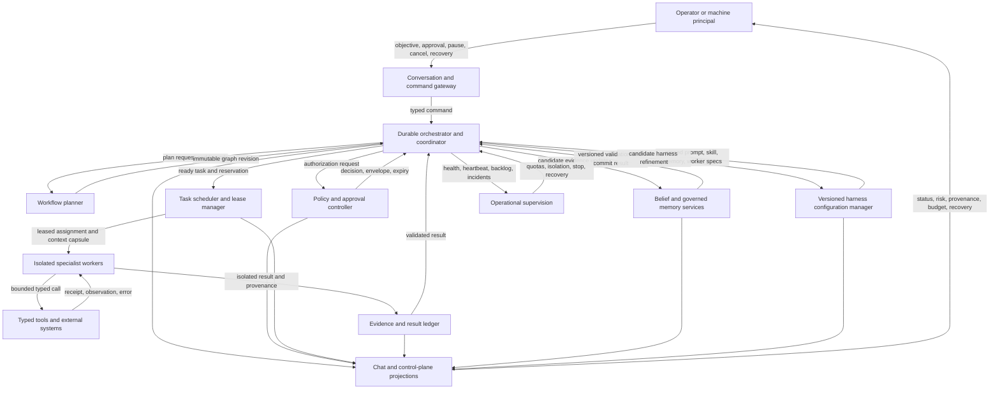

# STPA Workflow Control Analysis v1

Status: Phase 1 safety baseline
Date: 2026-08-10
Owners: platform architecture, agent runtime, safety, and operations
Machine-readable traceability: `docs/safety/safety-controls-v1.yaml`

## Purpose and boundary

This analysis applies STPA to the first governed workflow loop:

```text
plan -> approve -> delegate -> execute -> observe -> update belief or memory
```

Harness refinement is included as an upstream configuration-control action
because a changed prompt, skill, memory, or worker specification can alter every
later step. The analysis covers operator, conversation gateway, planner,
orchestrator, policy, scheduler, specialist workers, tools, external systems,
evidence, Bayesian belief, governed memory, harness configuration, and
operations.

The analysis does not assume that reliable components compose into a safe
system. It identifies unsafe interactions, missing or delayed feedback, stale
process models, and control actions supplied in unsafe contexts.

## Losses

| ID | Unacceptable loss |
| --- | --- |
| L-01 | An unauthorized, harmful, or commercially incorrect external or internal effect occurs. |
| L-02 | Tenant, customer, credential, or commercially sensitive data is disclosed or corrupted. |
| L-03 | Evidence, belief, memory, or harness state becomes untrustworthy and drives later decisions. |
| L-04 | Work, money, tokens, time, or service availability is lost through duplicate, runaway, or unrecoverable execution. |
| L-05 | An operator cannot understand, stop, recover, or attribute system behaviour. |
| L-06 | The platform makes a materially wrong commerce recommendation or optimization decision. |

## Control structure



## Controller process models and required feedback

| Controller | Safety-relevant process model | Feedback required before its next control action |
| --- | --- | --- |
| Operator or machine principal | Objective, expected effect, current run state, risk, approval scope, recovery options | Plain-language status, evidence, pending approvals, budgets, receipts, failures, and whether completion is validated |
| Planner | Objective version, authority and policy pins, active revision, available skills/tools, budgets | Revision acceptance/rejection, policy blockers, task outcomes, stale-plan signal, and replan allowance |
| Orchestrator/coordinator | Active revision, task/join state, command version, reservations, receipts, result validation | Event cursor, lease state, approval state, typed results, reconciliation, belief/memory commit result, and projection lag |
| Policy and approval controller | Principal, authority hash, effect class, payload hash, evidence threshold, approval expiry | Independent approval lifecycle, revocation, policy/version drift, execution receipt, and compensation result |
| Scheduler and lease manager | Ready set, tenant quotas, dependencies, reservations, attempt state, worker health | Lease acquisition, heartbeat, completion/failure, cancellation acknowledgement, stale-worker fencing, and queue pressure |
| Specialist worker | Immutable task/context hashes, authority, tools, budget, result schema, cancellation state | Tool outcomes, remaining budget, interrupt/cancel signal, coordinator acceptance/rejection, and retry decision |
| Belief and memory services | Prior/version, evidence provenance, tenant scope, contradiction and promotion policy | Validation outcome, posterior/version, calibration, contradiction, rollback, and downstream use |
| Harness configuration manager | Scope, base version, candidate diff, evidence, evaluation set, approval policy, active version | Evaluation results, approval, activation receipt, runtime regressions, rollback result, and affected sessions |
| Operations | Worker/process health, queues, quotas, isolation boundaries, external dependencies | Heartbeats, backlog, saturation, crash/recovery status, reconciliation gaps, and tenant impact |

## System hazards

| ID | Hazardous system state |
| --- | --- |
| H-01 | The system can issue or continue an effect outside valid authority, policy, approval, or evidence bounds. |
| H-02 | The system can repeat a committed effect or cannot determine whether an effect committed. |
| H-03 | Data, context, results, credentials, or state cross a tenant or assignment boundary. |
| H-04 | Scheduling or execution uses a stale, invalid, unapproved, or internally inconsistent plan or task state. |
| H-05 | Unvalidated, poisoned, mis-scoped, or contradicted information influences belief, memory, or a later decision. |
| H-06 | Recursion, parallelism, retries, tools, goals, or background work exceed bounded resources or cannot be stopped. |
| H-07 | Required work or recovery is never started, becomes stranded, or is terminated before a safe outcome. |
| H-08 | Operator and system projections report progress, safety, or completion inconsistently with durable state. |
| H-09 | Mutable harness or goal state causes uncontrolled behaviour drift, unsafe self-modification, or false completion. |
| H-10 | Concurrent workers interfere, oversubscribe shared resources, or commit inconsistent shared state. |

## Unsafe control actions

Every in-scope control action is assessed against the four STPA categories:

1. not providing the control action when required
2. providing it in an unsafe context
3. providing it too early, too late, or out of order
4. stopping it too soon or applying it too long

The complete 28-row UCA table and its mappings live in
`docs/safety/safety-controls-v1.yaml`. The catalog is authoritative because CI
checks that every control action has all four categories and that every UCA
maps to hazards, constraints, controls, feedback, and verification.

The seven assessed control actions are:

| ID | Control action |
| --- | --- |
| CA-01 | Commit an immutable plan or bounded replan revision. |
| CA-02 | Authorize, reject, revoke, or expire governed work. |
| CA-03 | Admit and delegate a task to a bounded specialist worker. |
| CA-04 | Start, continue, retry, cancel, or compensate execution. |
| CA-05 | Record an observation, receipt, error, or typed worker result. |
| CA-06 | Validate and commit a belief or governed-memory update. |
| CA-07 | Promote, retain, roll back, or reject supplemental harness state. |

## Principal causal scenarios

### Stale control models

- A plan is created against one policy, registry, authority, or belief version
  and scheduled after a newer version invalidates it.
- An approval remains apparently valid after the payload, evidence, plan
  revision, authority, or expiry changes.
- A coordinator sees a child as admitted or partially responsive and reports
  success before a typed result is complete and validated.
- A client disconnect, context compaction, worker restart, or REPL revival loses
  non-durable progress while the projection still reports the task as running.

### Parallelism and recursion

- Parallel children receive overlapping write authority or operate in one
  mutable workspace and produce conflicting changes.
- Budget checks happen after child admission, allowing concurrent reservations
  to oversubscribe the parent.
- A child can recursively create descendants without a host-enforced depth and
  resource check.
- A stale worker commits after its lease expired because the commit path does
  not validate a fencing token.
- A join accepts partial or duplicate results because membership, quorum, and
  result identity are not fixed to the active revision.

### Context, result, and memory poisoning

- Retrieved content or a child report contains instructions that are treated as
  policy, approval, or harness configuration.
- A context capsule includes another tenant's data, hidden credentials, or more
  conversation history than the assignee requires.
- Tool output, partial child output, or unverified external data is promoted as
  evidence, posterior belief, or durable memory.
- Contradicted evidence arrives after promotion but no feedback retires or
  recalibrates the affected state.

### Long-running execution and false completion

- A goal is marked complete because a time/token/turn limit was reached or a
  single gate passed, rather than because the objective and all mandatory
  safety conditions were satisfied.
- A heartbeat or schedule injects duplicate or out-of-order commands into an
  active task.
- Cancellation reaches the coordinator but not a background worker or external
  operation.
- A crash occurs between effect commit and receipt persistence, and recovery
  repeats the effect without reconciliation.

### Continual harness refinement

- A single anomalous trajectory becomes a global prompt, skill, memory, or
  worker rule without representative evaluation.
- Refinement rewrites the active base prompt or policy rather than producing a
  supplemental versioned candidate.
- Concurrent host and session writes overwrite one another or activate a
  mixture of harness versions.
- A harmful harness version remains active because runtime regressions are not
  linked to the activation and rollback path.

## Safety constraints

The traceability catalog defines the normative constraints. The central rules
are:

- The host/orchestrator, not model or REPL state, owns authority, lifecycle,
  reservations, policy, accounting, and completion.
- All commands, graph revisions, approvals, assignments, attempts, results,
  receipts, belief updates, memory promotions, and harness versions are scoped,
  versioned, and attributable.
- Authority and every budget dimension are non-expanding; reservations are
  atomic before parallel work begins.
- Only one valid lease can commit an attempt; committed effects are deduplicated
  and reconciled by durable receipts.
- Workers and recursive children return isolated typed results. Only the
  coordinator validates and commits shared workflow, belief, memory, or harness
  state.
- Context and returned content are data, never policy or permission.
- Goals, loops, retries, schedules, and recursion have explicit stopping limits,
  while reaching a limit never implies success.
- Harness refinement is supplemental, session-local by default, immutable by
  version, evidence-backed, evaluated, reversible, and unable to modify the
  beta execution path automatically.
- Operator views are projections, not the source of truth, and expose lag,
  uncertainty, partial results, receipts, and recovery state.

## Verification and change control

Run the traceability gate with:

```bash
make safety-traceability-check
```

Catalog statuses mean:

- `implemented`: the control exists in the repository and is linked to an
  exact pytest node that the traceability gate executes
- `planned`: the control is not yet relied upon and carries an owner and target
  phase

Changing a loss, hazard, control action, constraint, control, feedback
requirement, or verification entry requires a stable new identifier or an
explicit version of the catalog. Runtime work must not mark a control
implemented until its verification entry is executable.
