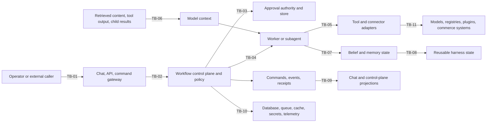

# Agent-Workflow Security Threat Model v1

Status: accepted Phase 1 baseline
Last updated: 2026-08-25
Normative catalog: `security-controls-v1.yaml`

## Decision

The platform will treat agentic execution as a distributed, multi-tenant,
partially untrusted control system. Model output, retrieved content, tool
output, child-worker results, learned memory, and supplemental harness state do
not carry authority. Only the host can grant authority, admit work, approve an
effect, reserve resources, commit shared state, and record the durable outcome.

This document explains the security model. The machine-readable catalog is the
normative traceability contract. CI pins its v1 identifier set, resolves its
references into the STPA safety catalog, and executes every test claimed by an
implemented security verification.

## Scope and method

The modeled flow is:

`objective -> plan -> approve -> delegate -> execute -> observe -> update belief/memory`

The analysis combines:

- STRIDE categories for adversarial behavior;
- misuse cases across each trust boundary;
- the existing STPA losses, hazards, and constraints for system-level effects;
- explicit preventative, detective, and verification controls;
- owned implementation gaps instead of aspirational “implemented” labels.

The model covers the current API and agent runtime plus the intended durable
workflow kernel, bounded parallel subagents, inter-agent results, governed
belief and memory updates, and supplemental continual-harness state. It does
not authorize capabilities excluded by the beta scope.

## Security objectives

1. A principal, prompt, worker, tool, message, or learned artifact cannot expand
   its tenant scope, capabilities, approval, effect class, or resource budget.
2. Untrusted content remains data and cannot become policy, authority,
   configuration, approval, or a durable instruction merely by appearing in a
   model context.
3. Only current, authenticated, approved, and fenced work can cause or record an
   effect, result, belief update, memory update, or harness promotion.
4. Every security-relevant decision and external outcome is attributable,
   tamper-evident, reconcilable, and visible with projection freshness.
5. A tenant, worker, connector, model, or infrastructure failure remains local
   through budgets, quotas, bulkheads, backpressure, cancellation, and recovery.
6. Secrets and tenant data cross only necessary, authenticated, scoped, and
   observable boundaries and never enter model context as raw ambient authority.

## Protected assets

| ID | Asset class |
| --- | --- |
| ASSET-01 | Tenant, customer, experiment, competitor, and commerce data |
| ASSET-02 | Human, agent, service, and worker identities and credentials |
| ASSET-03 | Authority envelopes, capability grants, approvals, and budgets |
| ASSET-04 | Approval, command, effect, and revocation receipts |
| ASSET-05 | Commands, events, revisions, attempts, leases, and checkpoints |
| ASSET-06 | Tool and connector credentials, traffic, and external receipts |
| ASSET-07 | Evidence, beliefs, memories, provenance, and contradictions |
| ASSET-08 | Harnesses, prompts, goals, skills, worker specs, and policy pins |
| ASSET-09 | Context capsules, messages, transcripts, and worker results |
| ASSET-10 | Audit, projections, logs, traces, metrics, alerts, and recovery evidence |

## Trust boundaries and data flow



The diagram is intentionally logical. A deployment can introduce more network
boundaries, but it cannot remove any of these authorization or validation
boundaries. The machine catalog requires every boundary to have at least one
threat mapping.

## Adversaries and assumed capabilities

- A malicious or compromised tenant user can submit objectives, prompts,
  identifiers, filters, connector arguments, and repeated requests and can
  observe responses available to that principal.
- An indirect prompt injector can control text returned by a website, document,
  tool, model, child worker, plugin, skill, or memory retrieval.
- A compromised worker can emit arbitrary results, replay assignments, retain
  stale context, delay cancellation, and attempt effects available to its host.
- A compromised dependency or provider can alter artifacts, responses,
  callbacks, redirects, timing, availability, or provenance.
- An insider or compromised service can access the privileges of that service
  but must not be able to erase attribution or silently cross tenant boundaries.
- Ordinary faults—partitions, retries, races, stale projections, crashes, queue
  lag, and partial external failure—can produce the same unsafe outcomes as an
  attacker and therefore use the same controls.

No adversary is assumed able to break standard cryptography. The host operating
system, CI identity, production secret store, and root signing keys are treated
as trusted computing base components; their compromise requires a deployment
and incident-response model beyond this application-level baseline.

## Threat register

The full attack path, affected assets and boundaries, STPA mappings, controls,
detections, verifications, and gaps are in `security-controls-v1.yaml`.

| ID | Scenario | Primary STRIDE categories | Risk and beta posture |
| --- | --- | --- | --- |
| THR-01 | Indirect prompt injection changes governed behavior | Tampering, elevation | Critical/active; partially mitigated |
| THR-02 | Confused deputy or excessive agency expands authority | Spoofing, elevation | Critical/active; partially mitigated |
| THR-03 | Approval substitution, drift, or stale authorization | Tampering, repudiation, elevation | High/active; partially mitigated |
| THR-04 | Command, event, receipt, callback, or message replay and forgery | Spoofing, tampering, repudiation | Critical/active; partially mitigated |
| THR-05 | Cross-tenant data or execution boundary failure | Disclosure, elevation | Critical/active; partially mitigated |
| THR-06 | Stale, impersonated, or split-brain worker commits work | Spoofing, tampering, denial | High/planned |
| THR-07 | Malicious or malformed worker result compromises coordinator | Tampering, disclosure, elevation | High/planned |
| THR-08 | Evidence, belief, or memory poisoning persists | Tampering, repudiation | High/active; partially mitigated |
| THR-09 | Unsafe harness self-modification or global promotion | Tampering, elevation | Critical/excluded and blocked |
| THR-10 | Credential theft or secret exfiltration | Spoofing, disclosure, elevation | Critical/active; partially mitigated |
| THR-11 | SSRF, unsafe egress, or connector target manipulation | Disclosure, elevation | High/active; planned control |
| THR-12 | Compromised model, skill, plugin, prompt, or dependency | Tampering, disclosure, elevation | Critical/planned |
| THR-13 | Resource exhaustion and unbounded fan-out deny service | Denial | High/active; partially mitigated |
| THR-14 | Cancellation, revocation, timeout, or compensation fails to propagate | Tampering, denial, repudiation | High/planned |
| THR-15 | Audit suppression, projection tampering, or repudiation | Tampering, repudiation | High/active; partially mitigated |
| THR-16 | Secrets or tenant data leak through context or observability | Disclosure | Critical/active; planned control |
| THR-17 | Tenant, connector, model, or infrastructure failure cascades | Denial, tampering | High/active; planned control |

## Control families

### Identity, tenancy, and authority

- SEC-01 authenticates principals and derives tenant and scopes from trusted
  claims. Existing API tests certify the implemented subset.
- SEC-02 enforces host capability, effect, approval, and budget policy. Existing
  policy and API tests certify the implemented subset.
- SEC-06 will bind approval to the exact execution envelope.
- SEC-09 will create minimal tenant-scoped context capsules in which untrusted
  data and opaque secret handles cannot grant authority.

### Integrity, replay, and distributed execution

- SEC-03 implements scoped request-hash idempotency for external jobs.
- SEC-04 implements expiring, single-use, run-bound provider callbacks.
- SEC-05 implements signed external-job receipts and inspectable command
  receipts.
- SEC-07 will protect durable workflow commands and events while allowing one
  command to append several events atomically.
- SEC-08 will bind workers to assignments with leases and fencing tokens.
- SEC-17 will make stop and recovery controls durable and acknowledged.
- SEC-20 will authenticate and bound inter-agent messages and typed results.

### Content, learning, and harness integrity

- SEC-10 will validate typed, size-bounded, provenance-carrying worker and tool
  results before coordinator commit.
- SEC-11 will validate evidence, Bayesian updates, contradictions, tenant scope,
  memory promotion, and rollback.
- SEC-12 will keep the base harness immutable and make refinements supplemental,
  evaluated, approved, versioned, reversible, and session-local by default.
- SEC-15 will pin and verify the provenance and allowed capabilities of models,
  dependencies, prompts, skills, plugins, and worker specifications.

### Secrets, egress, resilience, and accountability

- SEC-13 will provide secret handles, least privilege, centralized redaction,
  retention policy, and access auditing.
- SEC-14 will enforce outbound destination, scheme, address, redirect, DNS, and
  response policies.
- SEC-16 will atomically reserve hierarchical budgets and enforce bulkheads and
  backpressure.
- SEC-18 will detect audit and projection divergence and support deterministic
  rebuild and external reconciliation.
- SEC-19 will isolate tenant and dependency resources across storage, queues,
  caches, telemetry, quotas, and concurrency pools.

## Security invariants

1. Identity, tenant, authority, approval, and budget are host-issued data; no
   prompt, worker, tool, child workflow, or message may self-assert them.
2. Delegated authority and reserved budget are subsets of or equal to their
   parent bounds and can never expand through delegation.
3. Approval is specific, time bounded, revocable, and bound to the payload,
   evidence, authority, policy, and graph revision that will execute.
4. A retry may repeat computation but cannot repeat a committed external effect.
5. Only the current fenced attempt may commit a result or effect outcome.
6. Context, results, messages, memory, telemetry, and storage retain tenant scope
   end to end.
7. Tool output, retrieved content, child results, and learned state remain
   untrusted input; they cannot override policy or host instructions.
8. Only a coordinator can validate and commit shared workflow, belief, memory,
   or harness state.
9. Secrets are referenced by opaque handles and are disclosed only inside a
   scoped adapter at the moment of authorized use.
10. Every loop and dependency has bounded depth, concurrency, tokens, actions,
    retries, time, cost, queueing, and failure propagation.
11. Pause, cancel, revoke, timeout, and compensation reach every active unit of
    work and external operation or produce a visible escalation.
12. Operator projections expose durable revision, cursor, approval, lease,
    receipt, budget, recovery, and projection-lag state.

## Detection and response contract

The SDET records define required security telemetry without prescribing a
vendor. Events must be tenant scoped, access controlled, redacted, correlated
to workflow/task/attempt/command identifiers, and retained according to data
classification. Security detections must never include raw secrets or full
unminimized prompts by default.

Every alert requires an inspectable path to:

1. identify the principal, tenant, boundary, workflow, and affected assets;
2. pause or revoke affected authority without deleting evidence;
3. reconcile durable state and external receipts;
4. isolate the tenant, worker, connector, provider, or artifact;
5. recover or compensate with explicit operator acknowledgement;
6. update the threat, control, or verification catalog from incident evidence.

## Gap and release policy

`implemented` means the catalog names exact pytest nodes and the security gate
executes them. Existing tests certify only the bounded behavior they actually
exercise. A descriptive document, source file, uncollected node, or unrelated
test cannot certify a control.

`planned` means a named owner, target phase, verification contract, and GAP
record exist. `blocked` means the capability must not be exposed. A critical
active unresolved threat requires a structured `blocking_decision`. Its
capability-exclusion IDs are pinned per critical threat by the schema-v1
contract, then resolve through a separate release-gate map to the exact planned
controls and owned gaps required before exposure. A threat cannot weaken its
boundary by deleting an exclusion and its derived controls together. Free text
such as “ship anyway” cannot satisfy the gate.

`mitigated` is reserved for threats with no open gap mapping and structured
closure evidence. The immutable domain contract independently pins the minimum
control and verification sets for all 17 schema-v1 threats and accepts only the
named `security-review-board` authority. Release-gated threats also retain their
original blocking decision. Changing mutable threat mappings, closure evidence,
or status therefore cannot narrow the security boundary. Closed gap records
remain as historical evidence while their active threat and control links are
removed. The gate executes the tests behind every implemented verification ID.

`domain/security/contract_v1.py` is the sole schema-v1 authority. The executable
registry policy and security catalog are projections of it, not reciprocal
sources of truth. The contract pins `promote_variant_prod` and
`publish_copy_revision`, their tool and effect-class identities, the
`autonomous_production_publishing` gate, and SEC-06/SVT-06 plus SEC-16/SVT-16 as
release prerequisites. Runtime rejects those capabilities directly from the
domain contract when a run is admitted and immediately before an effect can
execute. Editing runtime dispositions and catalog exclusions together therefore
cannot release them. Adding an unclassified registry capability also fails.

Schema v1 does not contain an in-place release transition. Releasing a pinned
capability requires its prerequisite controls and executable verifications to
be implemented, an explicit security approval, and a new versioned domain
contract and catalog migration. This keeps a projection edit from masquerading
as a release decision.

The initial implemented controls cover authenticated scoped principals,
host-side capability and effect policy, external-job idempotency, single-use
provider callbacks, and signed external-job receipts. They do not certify the
future workflow kernel, worker fencing, parallel messages, context capsules,
harness promotion, egress control, or cross-infrastructure isolation.

## Beta boundaries

The following remain excluded until their mapped controls and tests are
implemented:

- autonomous production publishing, checkout, and payment execution;
- unrestricted browser, shell, filesystem, or network tools;
- recursive subagent spawning and open-ended peer-to-peer messaging;
- write-capable dynamic child delegation without approval and atomic budgets;
- automatic global harness, skill, prompt, policy, or workflow promotion;
- unreviewed memory promotion;
- expanded connectors without secret-handle, egress, and SSRF controls.

Read-only and low-risk current paths remain bounded by SEC-01 through SEC-05 and
the product's existing policy gates. A future slice cannot turn a planned
control into implemented status until its declared tests exist and pass through
the repository gate.

## Verification

Run:

```bash
make security-traceability-check
```

The command validates exact pinned v1 scope, global ID uniqueness, all local and
STPA references, complete threat coverage of assets, trust boundaries, controls,
detections, verifications, and open gaps, hazard-to-constraint coverage,
reciprocal gap ownership for every planned threat control, immutable closure
requirements for every threat, independently pinned critical-threat release
restrictions, executable-registry release-policy alignment, evidence-backed
mitigation closure, planned ownership, and executable implemented verifications.

Schema changes require a new version and an explicit migration decision. IDs
cannot be silently added to or deleted from schema v1 to make the gate pass.
