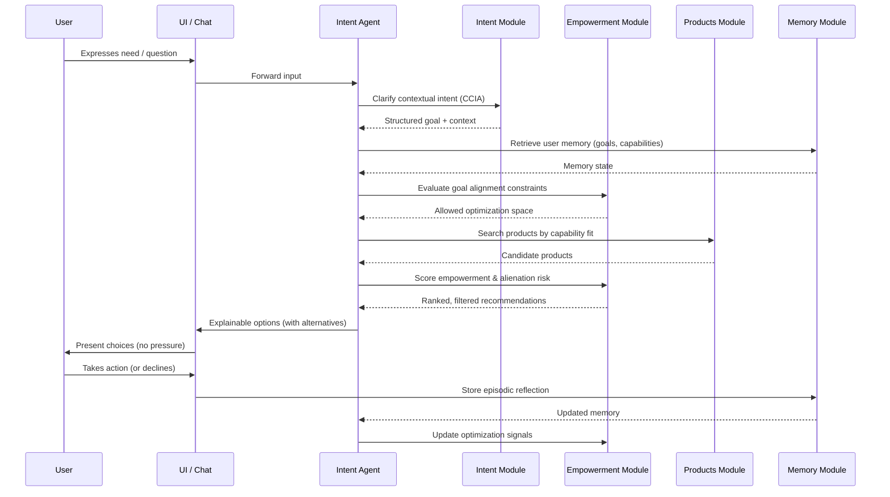

# Sequence Diagram
## Agentic Commerce Interaction (CCO Runtime)

This diagram illustrates a **single end-to-end interaction** in the Agentic Commerce runtime.

The flow emphasizes:
- intent clarification
- capability-based reasoning
- empowerment constraints
- reflection-driven learning

---

## High-Level Flow



---

## Key Properties of This Flow

### 1. Intent Precedes Execution
No product search occurs before goal clarification.

### 2. Empowerment Constrains Optimization
Recommendations are filtered by autonomy and alignment rules.

### 3. Products Are Optional, Not Mandatory
Non-commercial alternatives may be presented.

### 4. Reflection Is Mandatory
Outcomes update memory, not just analytics.

### 5. Behavior ≠ Success
Success is defined by empowerment metrics, not clicks.

---

## Module Mapping

| Sequence Step | Implementation |
|---------------|----------------|
| Clarify contextual intent | `src/intent/classifier.py` |
| Retrieve user memory | `src/memory/semantic.py`, `src/memory/working.py` |
| Evaluate goal alignment | `src/empowerment/goal_alignment.py` |
| Search products | `src/products/search.py` |
| Score empowerment | `src/empowerment/optimizer.py` |
| Check alienation risk | `src/empowerment/alienation.py` |
| Store reflection | `src/memory/episodic.py` |
| Generate explanation | `agents/explain_agent.py` |

---

## Why This Diagram Matters

Traditional commerce flows optimize for **action**.

This flow optimizes for **human outcome**.

The difference is not UI — it is the **order of reasoning and constraints**.

```
Traditional Flow:
User → Search → Rank by conversion probability → Push → Track click

CCO Flow:
User → Clarify goal → Check memory → Constrain by empowerment →
Search by capability → Filter by alienation risk → Present with alternatives →
Reflect on outcome → Update memory
```

---

## Architectural Invariants Enforced

This sequence enforces the [five architectural invariants](./architecture.md#7-architectural-invariants-non-negotiable-rules):

| Invariant | Where Enforced |
|-----------|----------------|
| Empowerment outranks commerce | Empowerment scoring before product ranking |
| Memory must exist | Memory retrieval and update steps |
| Agents orchestrate, modules decide | Intent Agent coordinates, modules execute |
| Products are instruments | Capability-fit search, not persuasion |
| Reflection is mandatory | Episodic memory update after action |

---

## References

- [architecture.md](./architecture.md) — System architecture overview
- [agency-layer.md](./agency-layer.md) — The four guardrails
- [terminology.md](./terminology.md) — Precise definitions

---

**End of Sequence Diagram**
