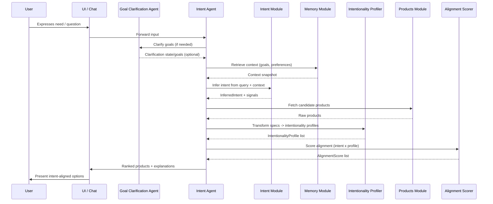

# Sequence Diagram
## Intentionality Optimization Flow (Runtime)

This diagram illustrates a single end-to-end interaction in the Intentionality Optimization runtime.

The flow emphasizes:
- intent inference
- intentionality profiling
- alignment scoring
- explainable ranking
- optional goal clarification

---

## High-Level Flow

```mermaid
sequenceDiagram
    participant U as User
    participant UI as UI / Chat
    participant GC as Goal Clarification Agent
    participant IA as Intent Agent
    participant IM as Intent Module
    participant MM as Memory Module
    participant IP as Intentionality Profiler
    participant PM as Products Module
    participant AS as Alignment Scorer

    U->>UI: Expresses need / question
    UI->>IA: Forward input

    IA->>GC: Clarify goals (if needed)
    GC-->>IA: Clarification state/goals (optional)

    IA->>MM: Retrieve context (goals, preferences)
    MM-->>IA: Context snapshot

    IA->>IM: Infer intent from query + context
    IM-->>IA: InferredIntent + signals

    IA->>PM: Fetch candidate products
    PM-->>IA: Raw products

    IA->>IP: Transform specs -> intentionality profiles
    IP-->>IA: IntentionalityProfile list

    IA->>AS: Score alignment (intent x profile)
    AS-->>IA: AlignmentScore list

    IA->>UI: Ranked products + explanations
    UI->>U: Present intent-aligned options
```

---

## Key Properties of This Flow

### 1. Intent Precedes Ranking
Products are ranked only after intent is inferred.

### 2. Products Are Intent-Legible
Specs are transformed into capability and outcome language for LLM reasoning.

### 3. Alignment Is Explainable
Each recommendation includes a human-readable rationale tied to intent.

### 4. Memory Improves Inference
Stored goals and preferences make intent inference more accurate over time.

---

## Module Mapping

| Sequence Step | Implementation |
|---------------|----------------|
| Infer intent | `modules/intent/` |
| Retrieve memory | `modules/memory/` |
| Profile intentionality | `modules/intentionality/` |
| Search products | `modules/commerce/search.py` |
| Score alignment | `modules/alignment/` |
| Generate explanations | `modules/conversation/agents.py` |

---

## References

- [architecture.md](./architecture.md) — System architecture overview
- [terminology.md](./terminology.md) — Definitions and naming conventions
- [strategic-positioning.md](./strategic-positioning.md) — Market positioning

---

**End of Sequence Diagram**
