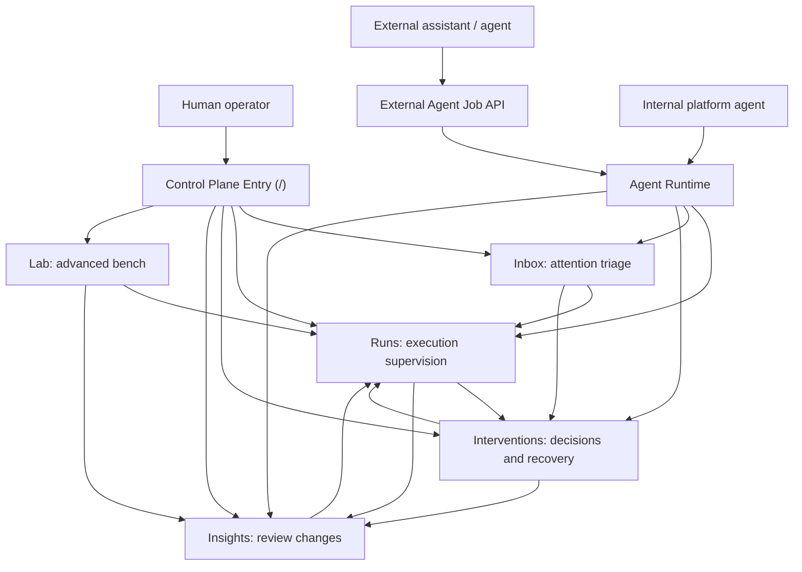
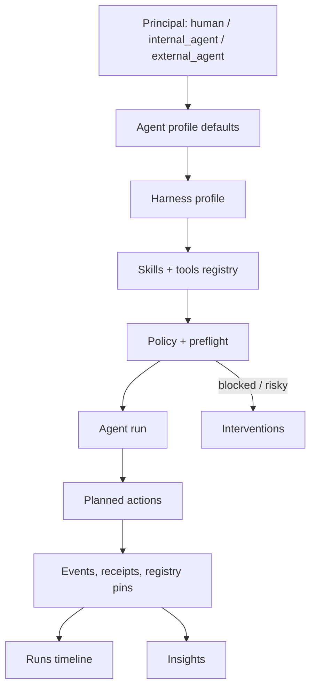
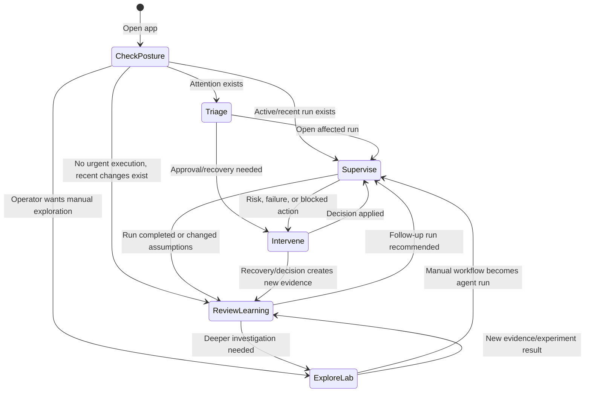

# UX Flow Schema

Status: current
Last updated: 2026-05-14

This schema describes how the app functions across its main UX modes. It is intentionally product-level: use it to reason about navigation, operator intent, and where agent-led execution should surface in the UI.

## Core Principle

The app has two connected layers:

- **Control plane:** default human interface for supervision, explanation, intervention, and learning.
- **Lab bench:** advanced workspace for exploratory, human-led investigation and manual workflow design.

The control plane should be the default. The lab should remain available when the operator intentionally wants to drive or inspect work in detail.

## Primary UX Modes

| Mode | Routes | Purpose | Operator Question | System Behavior |
| --- | --- | --- | --- | --- |
| Entry | `/` | Choose the right workspace from current operational state. | Where should I look first? | Summarizes posture and routes to Inbox, Runs, Interventions, Insights, or Lab. |
| Attention | `/inbox` | Triage blocked, failed, approval-needed, or review-needed work. | What needs attention now? | Groups recent execution by urgency/risk and links into specific runs/interventions. |
| Supervision | `/runs` | Inspect and steer active/recent agent execution. | What is the agent doing and why? | Shows run state, actions, timeline, registry, harness, policy, receipts, and operator chat. |
| Intervention | `/interventions` | Make explicit human decisions. | What do I need to approve, reject, retry, pause, or escalate? | Presents risky or blocked work as decision objects with preflight and confirmation. |
| Insights | `/learnings` | Review what changed and what the system learned. | What changed, what needs review, and what should happen next? | Summarizes outcomes, evidence, validation, recurring issues, and follow-up signals before exposing deeper mechanics. |
| Advanced Lab | `/lab`, `/alignment`, `/evidence`, `/simulation`, `/experiments`, `/validation`, `/overview` | Explore, debug, and manually drive workflows. | What do I want to investigate or design directly? | Exposes deeper workflow tools that can later become agent-operated. |
| Administration | `/admin` | Configure tenant/catalog/admin posture. | What system settings or catalog data need governance? | Handles setup/configuration outside the daily execution loop. |

## High-Level Flow



## Agent Execution Flow



## Operator Decision Loop



## Mode Details

### Entry Mode

The root page is not a full dashboard. It should answer:

- Is execution healthy?
- Is anything blocked or risky?
- Should the operator start in Inbox, Runs, Interventions, Insights, or Lab?

Expected behavior:

- Recommend one primary next surface.
- Keep Lab available but secondary.
- Avoid duplicating every dashboard metric.

### Attention Mode

Inbox is the triage layer.

Expected behavior:

- Group by urgency and risk.
- Separate critical failures, review-needed work, and watch-only items.
- Link directly to the affected run or intervention.

Inbox should not become a second Runs page. It should show what deserves attention, not every execution detail.

### Supervision Mode

Runs is the main execution workspace.

Expected behavior:

- Show the selected run, action queue, timeline, and operator chat.
- Show principal, agent profile, harness, policy, registry version, skill/tool lineage, and receipts.
- Let the operator preview and issue safe commands.
- Send risky decisions to explicit confirmation/preflight flows.

Runs is where the operator understands what the agent is doing.

### Intervention Mode

Interventions is the explicit control layer.

Expected behavior:

- Surface approvals, rejects, retries, pauses, escalations, and recovery proposals.
- Explain risk, side effects, blockers, rollback, and recommended safer paths.
- Record decisions as auditable command/approval events.

Interventions is where human accountability is concentrated.

### Insights Mode

Insights compress recent platform behavior.

Expected behavior:

- Show what changed recently.
- Summarize validation outcomes, calibration drift, belief movement, and recurring failure modes.
- Recommend follow-up work.

Insights should turn execution history into operator memory while keeping internal mechanisms behind explanation and audit details.

### Advanced Lab Mode

Lab routes are still valuable, but they are no longer the default mental model.

Expected behavior:

- Support manual investigation, experimentation, validation, and evidence inspection.
- Keep a consistent visual language with the control plane.
- Make it easy for useful manual workflows to become agent-operated runs.

Lab is the notebook. Runs is the execution control room.

## Channel Types

Agent-profile `channel_type` describes how that profile normally enters the platform.

| Channel | Meaning | Typical UX/API Entry |
| --- | --- | --- |
| `web_ui` | Human/operator-led entry. | Control plane and Lab routes. |
| `runtime` | Internal platform agent entry. | Agent runtime scheduler/tick. |
| `external_job_api` | External assistant or partner agent entry. | `/external-agent/jobs`. |

Channel type is metadata today, but it should later influence default receipts, retry posture, fallback permissions, and operator visibility.

## Safety Routing Rules

- Read-only or low-risk work can stay in Runs when policy allows it.
- Approval-needed work should surface in Interventions.
- External side effects should require explicit review unless the harness/policy allows them.
- Failed actions should produce recovery proposals rather than silent mutation.
- Any operator chat mutation should map to a visible structured command, preflight, or receipt.

## Intended Future Shape

The mature product should feel like:

```text
Agents do the work.
Runs explain the work.
Inbox tells humans where attention is needed.
Interventions capture accountable decisions.
Insights preserve what changed.
Lab remains the advanced bench for exploration and workflow invention.
```
